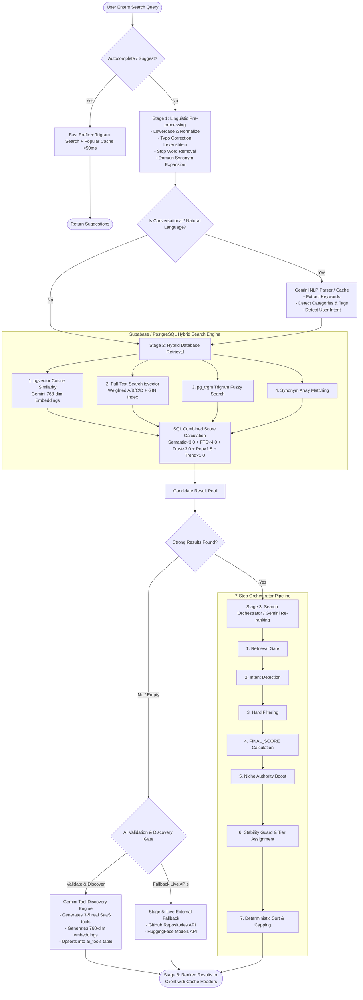

# ArcynFind Intelligent Search Architecture & Algorithm Documentation

> **Version:** 2.0  
> **Classification:** Technical Architecture & Algorithm Reference  
> **Status:** Production  
> **Stack:** Next.js 15, PostgreSQL 15+ (Supabase), pgvector, Google Gemini AI, GitHub & HuggingFace APIs

---

## Executive Summary

ArcynFind utilizes a **Multi-Tier Hybrid Search Engine** designed specifically for discovering, evaluating, and ranking AI tools, models, and agents. Rather than relying on simple keyword matching or standalone vector retrieval, ArcynFind combines:

1. **Linguistic Query Pre-processing** (typo tolerance, stop-word pruning, synonym expansion)
2. **AI-Powered Natural Language Understanding** (intent classification, entity extraction)
3. **Hybrid Database Retrieval** (PostgreSQL FTS + pgvector Cosine Semantic Search + Trigram Fuzzy Search)
4. **Deterministic & AI-Assisted Re-Ranking** (7-step Orchestration Pipeline with intent-aware scoring)
5. **Self-Healing Indexing & AI Discovery** (automatic discovery and database ingestion of missing tools)
6. **Real-Time External Fallbacks** (GitHub REST API v3 & HuggingFace Models API)
7. **Two-Layer High-Performance Caching** (in-memory LRU + persistent PostgreSQL search cache)

---

## Architecture Flowchart



---

## 1. Technologies & Models Powering the Search

| Component | Technology / Service | Specific Role / Model |
| :--- | :--- | :--- |
| **Vector Database** | **Supabase (PostgreSQL 15+)** | `pgvector` extension storing 768-dimensional float vectors with HNSW/IVFFlat cosine distance indexing. |
| **Full-Text Search Engine** | **PostgreSQL Native FTS** | `tsvector` with weighted fields (`A` for title/tags, `B` for category, `C` for description, `D` for platform) indexed via `GIN`. |
| **Fuzzy Matching** | **PostgreSQL `pg_trgm`** | Trigram string similarity indexing for misspelled and substring queries. |
| **Semantic Embedding Model** | **Google Gemini** | `gemini-embedding-001` (768 dimensions), producing normalized semantic representations for queries and tools. |
| **LLM Orchestrator & NLP** | **Google Gemini** | **Primary:** `gemini-3-flash-preview` / `gemini-1.5-flash`<br>**Fallback:** `gemini-flash-latest` (handling query understanding, intent classification, result validation, and ranking). |
| **External Live Fallbacks** | **GitHub & HuggingFace REST APIs** | Live querying of active open-source AI projects, code assistants, and ML pipelines when internal results are sparse. |
| **Web Speech Integration** | **HTML5 Web Speech API** | Client-side `webkitSpeechRecognition` for voice-driven search queries. |
| **Framework & Runtime** | **Next.js 15 (Node.js/Edge)** | Type-safe API routes (`/api/ai-models`, `/api/search/rank`, `/api/search/suggest`). |

---

## 2. In-Depth Step-by-Step Algorithm Breakdown

### Stage 1: Linguistic Query Pre-processing (`lib/search-utils.ts`)

Every user query undergoes deterministic multi-stage normalization before reaching the database:

1. **Normalization (`normalizeQuery`)**:
   - Converts to lowercase.
   - Strips non-alphanumeric characters (retaining hyphens for compound tech terms like `speech-to-text`).
   - Collapses irregular multi-space sequences.
2. **Typo Correction (`correctTypos`)**:
   - Matches words against a curated dictionary of common search typos:
     - `pwoerpoint`, `powerpint` $\rightarrow$ `powerpoint`
     - `summarise`, `summerize`, `sumarize` $\rightarrow$ `summarize`
     - `presnetation`, `documnet`, `trascribe`, `marketting`, `desing` $\rightarrow$ corrected forms.
3. **Stop-Word Removal (`removeStopWords`)**:
   - Strips conversational fillers (`want`, `need`, `looking for`, `help me`, `tool`, `app`, `find`, `please`) while retaining meaningful intent words.
4. **Domain Synonym Expansion (`expandWithSynonyms`)**:
   - Expands terms across key AI domains:
     - *Document types:* `powerpoint` $\rightarrow$ `presentation`, `ppt`, `slides`, `deck`
     - *Actions:* `summarize` $\rightarrow$ `summary`, `condense`, `shorten`, `tldr`, `digest`
     - *AI domains:* `chatbot` $\rightarrow$ `assistant`, `conversational`, `gpt`; `image` $\rightarrow$ `photo`, `visual`, `art`
   - Limits expansion to the top 2 highest-relevance synonyms to prevent query dilution.

---

### Stage 2: Natural Language Understanding with Gemini (`lib/gemini.ts`)

When a query is conversational ($>15$ characters or containing phrasing like *"find me a tool that can..."*), ArcynFind routes the query to the Gemini NLP engine:

- **Cache First:** Checks the in-memory cache and Supabase `search_cache` table to avoid redundant token expenditure.
- **Extraction:** Gemini extracts structured parameters:
  - `keywords`: Key technical terms (e.g., `["pdf converter", "pdf to word"]`)
  - `categories`: Matched against ArcynFind's 17 core categories (e.g., `["Productivity", "Writing & Content"]`)
  - `tags`: Specific sub-facets (e.g., `["pdf", "word", "converter"]`)
  - `intent`: Concrete user goal description.
- **Persistence:** Extracted parameters are stored in `search_cache` for instant zero-token lookups on subsequent queries.

---

### Stage 3: Hybrid Database Retrieval (`search_tools_advanced` SQL Stored Procedure)

The core database retrieval runs directly in PostgreSQL via the `search_tools_advanced` function (`supabase/migrations/update_advanced_search_v2.sql`). It simultaneously executes four parallel retrieval paths:

```
Path 1: Cosine Semantic Distance   → (1 - (embedding <=> query_embedding)) > 0.20
Path 2: Full-Text Search Match     → tsquery_val @@ t.fts_vector
Path 3: Trigram ILIKE Safety Net   → query_tokens matched against name/description
Path 4: Synonym-Expanded Keywords  → extra_keywords matched against name/description
```

#### SQL Weighted Scoring Formula

All signals are normalized to $[0.0, 1.0]$ prior to weighting:

$$\text{Combined Score} = (S_{\text{semantic}} \times 3.0) + (S_{\text{FTS}} \times 4.0) + (S_{\text{trust}} \times 3.0) + (S_{\text{popularity}} \times 1.5) + (S_{\text{trending}} \times 1.0)$$

Where:
- $S_{\text{semantic}} = 1 - (\text{tool\_embedding} \Leftrightarrow \text{query\_embedding})$ (Cosine Similarity, 0 to 1)
- $S_{\text{FTS}} = \min(\text{ts\_rank}(\text{fts\_vector}, \text{query}) \times 4.0, 1.0)$ (Weighted FTS Rank)
- $S_{\text{trust}} = \min(\text{COALESCE}(\text{priority}, 50) / 100.0, 1.0)$ (Verified Source Trust)
- $S_{\text{popularity}} = \min(\text{popularity} / 10000.0, 1.0)$ (Normalized Popularity)
- $S_{\text{trending}} = 1.0 \text{ if trending, else } 0.0$

---

### Stage 4: Strict Deterministic Search Orchestrator (`lib/search-orchestrator.ts` & `lib/search-pipeline.ts`)

Once candidates are retrieved, they enter the 7-Step Search Orchestrator. The orchestrator can run via Gemini LLM re-ranking (`runSearchPipeline`) or through the deterministic mathematical fallback (`runSearchOrchestrator`):

#### The 7 Pipeline Steps:

1. **Step 1 — Retrieval Gate:**
   - Assesses candidate pool quality.
   - Flags low-quality pools if candidate count $<3$, $>70\%$ have descriptions $<10$ characters, or no candidates share surface-level keyword overlap.
2. **Step 2 — Intent Classification:**
   - Detects one of 5 canonical intents:
     - `navigational` (*"ChatGPT login"*, *"Midjourney official"*)
     - `informational` (*"what is Claude 3.5"*, *"how does Stable Diffusion work"*)
     - `transactional` (*"download cursor"*, *"buy perplexity pro"*)
     - `comparative` (*"Claude vs GPT-4"*, *"best alternatives to ElevenLabs"*)
     - `exploratory` (*"AI video tools"*, *"coding assistants"*)
3. **Step 3 — Hard Filtering:**
   - Discards stubs (descriptions $<15$ chars or containing *"lorem ipsum"*, *"coming soon"*, *"placeholder"*).
   - Eliminates near-duplicate titles using normalized string matching.
   - Enforces query term relevance requirements.
4. **Step 4 — FINAL_SCORE Computation:**
   $$\text{FINAL\_SCORE} = (\text{Exact KW} \times 4) + (\text{Semantic} \times 3) + (\text{Intent Fit} \times 4) + (\text{Source Trust} \times 3) + (\text{Popularity} \times 1) + (\text{Freshness} \times 1)$$
   - *Intent Adjustments:*
     - `navigational`: Doubles exact keyword match weight ($\times 8$).
     - `informational`: Multiplies freshness weight ($\times 2$) and favors descriptive depth.
     - `transactional`: Favors active platform tools over informational articles.
     - `comparative`: Rewards tools explicitly documenting alternatives and pros/cons.
   - *Freshness Decay:* Linear decay from $10.0$ (updated today) to $0.0$ at 730 days (2 years).
5. **Step 5 — Niche Authority Boost:**
   - Verified / Curated ArcynFind entries: **$+2.0$ boost**.
   - Generic auto-indexed aggregations without category/tags: **$-1.0$ to $-2.0$ penalty**.
6. **Step 6 — Stability Guard & Tiering:**
   - `tier_A` ($\text{Score} \ge 8.0$): High confidence, prime placement.
   - `tier_B` ($5.0 \le \text{Score} < 8.0$): Medium confidence, standard placement.
   - `tier_C` ($\text{Score} < 5.0$): Low confidence — **suppressed from initial result set**.
7. **Step 7 — Deterministic Sort & Capping:**
   - Capped at maximum 10 results (never padded).
   - Multi-tier tiebreakers:
     1. Verified / Official source status.
     2. Category / tag coverage breadth.
     3. Content freshness date.

---

### Stage 5: Self-Healing AI Discovery & Live Fallbacks (`lib/gemini.ts` & `lib/search-fallback.ts`)

ArcynFind features automated recovery when local database matches are insufficient:

#### 1. AI Tool Discovery & Automatic Database Ingestion
If a natural language search yields zero or irrelevant results:
1. Gemini generates 3 to 5 real-world, functional SaaS tools matching the query.
2. The system calls `generateToolEmbedding()` to produce 768-dimensional vectors for each new tool.
3. Tools and embeddings are automatically saved (`upsert`) into the `ai_tools` Supabase table.
4. **Result:** Subsequent searches for the same topic find the tools directly in PostgreSQL without spending future AI tokens.

#### 2. Live GitHub & HuggingFace Fallback
If API keys or database entries are exhausted:
- Queries the **GitHub REST API** for top-starred repositories matching the topic.
- Queries the **HuggingFace API** for high-download ML models matching the pipeline.
- Automatically maps external data into ArcynFind's standard `AIEntry` format.
- Deduplicates and interleaves external results with existing results.

---

### Stage 6: Tool Similarity & Alternative Recommendations (`lib/similar-tools.ts`)

For tool comparison pages and *"Alternatives to X"* queries, ArcynFind uses a dedicated similarity scoring function:

$$\text{Similarity Score} = S_{\text{category}} (50\text{ pts}) + S_{\text{shared\_tags}} (\le 40\text{ pts}) + S_{\text{pricing}} (5\text{ pts}) + S_{\text{keywords}} (\le 10\text{ pts}) + S_{\text{pop\_trend}} (\le 5\text{ pts})$$

- Matches tools within the same category.
- Evaluates Jaccard-style tag overlap (10 points per shared tag, max 40).
- Compares pricing models (`Free`, `Freemium`, `Paid`).
- Extracts non-stopword description keywords and computes feature overlap.

---

### Stage 7: Sub-50ms Autocomplete & Suggestions (`/api/search/suggest`)

The search suggestion endpoint provides high-speed typeahead:
- **Prefix Matching:** Indexed B-tree lookup on `ai_tools.name`.
- **Search Frequency Cache:** Queries `search_cache.query_text` ordered by `use_count DESC`.
- **Category Autocomplete:** Matches user keystrokes against all 17 primary categories.
- **Zero Gemini Latency:** Operates purely on database indexes to maintain $<50\text{ms}$ response times.

---

## 3. Data Flow & Scoring Matrix Summary

| Signal | Source | Weight | Purpose |
| :--- | :--- | :--- | :--- |
| **Exact Keyword Match** | Title & Name equality | $\times 4.0$ (or $\times 8.0$) | Ensures direct tool name lookups immediately hit #1 rank. |
| **FTS Keyword Match** | `fts_vector` GIN index | $\times 4.0$ | Syntactic text matching across title, category, and description. |
| **Semantic Vector Similarity** | `gemini-embedding-001` (768-d) | $\times 3.0$ | Conceptual matching even when exact words differ (e.g. "make slides" $\rightarrow$ "presentation tools"). |
| **Intent Fit** | Query Intent Classifier | $\times 4.0$ | Aligns tool characteristics with user intention (navigational, transactional, etc.). |
| **Source Trust** | Curated `priority` column | $\times 3.0$ | Elevates verified, human-vetted AI platforms. |
| **Popularity** | View / click counts | $\times 1.5$ | Promotes widely-adopted community favorites. |
| **Freshness** | `last_updated` ISO date | $\times 1.0$ (or $\times 2.0$) | Decays stale tools older than 2 years; boosts recently updated models. |
| **Niche Authority Boost** | Verification flag | $+2.0\text{ / }-1.0$ | Direct additive modifier for verified tools and penalizer for empty stubs. |

---

## 4. Key Engineering Highlights & Best Practices

1. **Deterministic Guarantees:** For any identical query and candidate pool, ranking is 100% deterministic and reproducible.
2. **Token Efficiency:** Multi-tiered caching (in-memory LRU + PostgreSQL `search_cache`) ensures frequent queries cost zero Gemini API tokens.
3. **Resilience & Graceful Degradation:**
   - Gemini unavailable $\rightarrow$ Deterministic local TypeScript orchestrator takes over.
   - Vector search unavailable $\rightarrow$ Full-Text Search with Trigram fuzzy fallback activates.
   - Database empty $\rightarrow$ Real-time GitHub & HuggingFace live APIs supply results.
4. **Self-Expanding Corpus:** Queries for unindexed AI tools trigger background AI discovery that embeds and saves new tools into the database.
