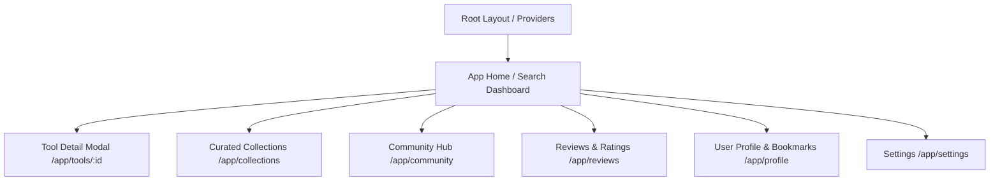

# ARCYN Find - UI/UX Component & Design Architecture

This document provides a comprehensive overview of the **UI/UX architecture, component hierarchy, design system tokens, and interactive flows** powering ARCYN Find.

---

## 📁 1. Directory Structure Overview

All UI and UX components are located in the [`components/`](file:///c:/Users/DELL/Documents/ARCYN/Arcyn-Find/components) and [`app/`](file:///c:/Users/DELL/Documents/ARCYN/Arcyn-Find/app) directories:

```
ARCYN-Find/
├── app/                              # Next.js App Router (Pages, Layouts, Global Styles)
│   ├── layout.tsx                    # Root layout with fonts, metadata, providers
│   ├── client-layout.tsx             # Client providers (Auth, Theme, Language, Tooltip)
│   ├── globals.css                   # Design tokens, Tailwind directives, safe-area insets
│   ├── page.tsx                      # Main discovery & search dashboard
│   ├── collections/                  # Tool stacks & curated lists
│   ├── community/                    # Social feeds, user stacks, discussions
│   ├── reviews/                      # User review feeds & rating submission
│   ├── profile/                      # User bookmarks, custom collections, profile
│   ├── settings/                     # User preferences, themes, language
│   ├── tools/[id]/                   # Dedicated tool detail page
│   └── onboarding/                   # First-time user welcome flow
│
├── components/
│   ├── layout/                       # Structural app chrome & navigation
│   │   ├── navbar.tsx                # Main top navigation bar & search triggers
│   │   ├── sidebar.tsx               # Left desktop navigation & category filter tree
│   │   ├── mobile-nav.tsx            # Bottom touch bar for mobile viewport
│   │   ├── theme-toggle.tsx          # Dark / Light / System theme switch
│   │   └── language-picker.tsx       # Multi-language selector dropdown
│   │
│   ├── search/                       # Search, filtering & AI querying engine
│   │   ├── premium-search-input.tsx  # Hero search bar with glow & keyboard shortcuts
│   │   ├── search-bar.tsx            # Standard compact header search input
│   │   ├── ai-suggestions.tsx        # Smart prompt suggestions & trending chips
│   │   ├── filter-bar.tsx            # Category, pricing & region filter chips
│   │   ├── browser-search-animation.tsx # Web-crawling live radar animation
│   │   ├── search-highlight.tsx      # Keyword match highlighter
│   │   ├── search-skeleton.tsx       # Skeleton loader for query processing
│   │   └── user-search.tsx           # Community user discovery & search
│   │
│   ├── tools/                        # AI tool display & inspection cards
│   │   ├── tool-card.tsx             # Standard grid/list AI tool card
│   │   ├── enhanced-tool-detail-modal.tsx # Rich modal with specs, pros/cons, reviews
│   │   ├── tool-image.tsx            # Smart image/favicon loader with fallbacks
│   │   ├── pricing-badge.tsx         # Color-coded pricing tags (Free/Freemium/Paid)
│   │   ├── collection-card.tsx       # Card representing a curated set of tools
│   │   └── review-card.tsx           # User rating card with helpfulness votes
│   │
│   ├── feedback/                     # States, dialogs & onboarding
│   │   ├── onboarding-modal.tsx      # Interactive multi-step user onboarding tour
│   │   ├── empty-state.tsx           # Zero-results & clear filter screen
│   │   ├── loading-skeleton.tsx      # Shimmer placeholders for grids & cards
│   │   ├── error-boundary.tsx        # Resilient crash handler & retry view
│   │   └── maintenance-scene.tsx     # System maintenance notice & art
│   │
│   └── ui/                           # Base design primitives (Radix + Tailwind)
│       ├── accordion.tsx, alert-dialog.tsx, avatar.tsx, badge.tsx, button.tsx,
│       ├── card.tsx, dialog.tsx, dropdown-menu.tsx, input.tsx, label.tsx,
│       ├── popover.tsx, progress.tsx, radio-group.tsx, scroll-area.tsx,
│       ├── select.tsx, separator.tsx, slider.tsx, sonner.tsx, spinner.tsx,
│       └── switch.tsx, tabs.tsx, textarea.tsx, tooltip.tsx
│
└── contexts/                         # React context state providers
    ├── auth-context.tsx              # Supabase session, auth state & profile
    ├── language-context.tsx          # Internationalization dictionary & hook
    ├── preferences-context.tsx       # View mode (grid/list), filter history
    └── avatar-context.tsx            # Avatar customizer & sync
```

---

## 🎨 2. Design System & Aesthetics

### Color Palette & Tokens
- **Theme**: Automatic Dark / Light mode with OLED-friendly dark surfaces and glassmorphic card overlays.
- **Accents**: 
  - Indigo / Violet / Cyan gradients for AI accents.
  - Emerald / Green for **Free** access badges.
  - Amber / Yellow for **Freemium** / Featured items.
  - Rose / Pink for **Paid** / Enterprise items.
- **Typography**: Responsive scale starting at 14px on mobile up to 16px desktop base with crisp tracking.
- **Micro-Interactions**: Hover lift effects, smooth scale transitions, shimmering loading states, and badge pulses.
- **Mobile Optimizations**: iOS safe-area insets (`--safe-area-inset-bottom`), 44px+ minimum touch targets, touch-callout suppression, and anti-zoom inputs (16px base font on mobile).

---

## 🧩 3. Component Details & Responsibilities

### 🔹 Layout Components ([`components/layout`](file:///c:/Users/DELL/Documents/ARCYN/Arcyn-Find/components/layout))
| Component | Path | Description |
| :--- | :--- | :--- |
| **`Navbar`** | [`navbar.tsx`](file:///c:/Users/DELL/Documents/ARCYN/Arcyn-Find/components/layout/navbar.tsx) | Sticky top bar containing brand logo, quick search trigger, language switcher, theme switch, bookmark count, and user profile / auth button. |
| **`Sidebar`** | [`sidebar.tsx`](file:///c:/Users/DELL/Documents/ARCYN/Arcyn-Find/components/layout/sidebar.tsx) | Collapsible navigation sidebar organizing tools by taxonomy categories (Generative AI, Agents, Code, Design, Productivity, etc.) with tool counters. |
| **`MobileNav`** | [`mobile-nav.tsx`](file:///c:/Users/DELL/Documents/ARCYN/Arcyn-Find/components/layout/mobile-nav.tsx) | Fixed bottom dock for mobile devices with quick access to Home, Explore, Collections, Community, and Profile. |
| **`ThemeToggle`** | [`theme-toggle.tsx`](file:///c:/Users/DELL/Documents/ARCYN/Arcyn-Find/components/layout/theme-toggle.tsx) | Dropdown/toggle button switching between Light, Dark, and System color schemes. |
| **`LanguagePicker`**| [`language-picker.tsx`](file:///c:/Users/DELL/Documents/ARCYN/Arcyn-Find/components/layout/language-picker.tsx) | Multi-lingual locale selector providing instant UI translation across supported languages. |

---

### 🔹 Search & Discovery ([`components/search`](file:///c:/Users/DELL/Documents/ARCYN/Arcyn-Find/components/search))
| Component | Path | Description |
| :--- | :--- | :--- |
| **`PremiumSearchInput`** | [`premium-search-input.tsx`](file:///c:/Users/DELL/Documents/ARCYN/Arcyn-Find/components/search/premium-search-input.tsx) | High-impact hero search input featuring dynamic placeholder cycling, glassmorphic styling, keyboard command triggers (`Cmd+K`), voice search, and clear buttons. |
| **`SearchBar`** | [`search-bar.tsx`](file:///c:/Users/DELL/Documents/ARCYN/Arcyn-Find/components/search/search-bar.tsx) | Compact header search input with debounced querying and hotkey focus. |
| **`AISuggestions`** | [`ai-suggestions.tsx`](file:///c:/Users/DELL/Documents/ARCYN/Arcyn-Find/components/search/ai-suggestions.tsx) | Smart search prompt chips ("Find tools to summarize PDFs", "Best AI for coding", etc.) and autocomplete suggestions. |
| **`FilterBar`** | [`filter-bar.tsx`](file:///c:/Users/DELL/Documents/ARCYN/Arcyn-Find/components/search/filter-bar.tsx) | Multi-select category pills, pricing filters (Free, Freemium, Paid), regional tags, and view toggles (Grid vs. List). |
| **`BrowserSearchAnimation`** | [`browser-search-animation.tsx`](file:///c:/Users/DELL/Documents/ARCYN/Arcyn-Find/components/search/browser-search-animation.tsx) | Animated scanning radar and crawling animation displayed when triggering live AI discovery or fallback searches. |
| **`SearchHighlight`** | [`search-highlight.tsx`](file:///c:/Users/DELL/Documents/ARCYN/Arcyn-Find/components/search/search-highlight.tsx) | Text utility that highlights matching query substring segments inside tool names and descriptions. |
| **`SearchSkeleton`** | [`search-skeleton.tsx`](file:///c:/Users/DELL/Documents/ARCYN/Arcyn-Find/components/search/search-skeleton.tsx) | Animated shimmer placeholders representing tools during initial or filtered search data fetching. |
| **`UserSearch`** | [`user-search.tsx`](file:///c:/Users/DELL/Documents/ARCYN/Arcyn-Find/components/search/user-search.tsx) | Dedicated member search for finding creators, community collections, and tool stack curators. |

---

### 🔹 Tool Cards & Detail Views ([`components/tools`](file:///c:/Users/DELL/Documents/ARCYN/Arcyn-Find/components/tools))
| Component | Path | Description |
| :--- | :--- | :--- |
| **`ToolCard`** | [`tool-card.tsx`](file:///c:/Users/DELL/Documents/ARCYN/Arcyn-Find/components/tools/tool-card.tsx) | Primary AI tool card showing icon, name, category, pricing pill, short description, tags, bookmark button, and click-to-inspect trigger. |
| **`EnhancedToolDetailModal`** | [`enhanced-tool-detail-modal.tsx`](file:///c:/Users/DELL/Documents/ARCYN/Arcyn-Find/components/tools/enhanced-tool-detail-modal.tsx) | Deep-dive modal drawer displaying screenshots, full description, key features, pricing tiers, verified reviews, alternatives, platform links, and share dialogs. |
| **`ToolImage`** | [`tool-image.tsx`](file:///c:/Users/DELL/Documents/ARCYN/Arcyn-Find/components/tools/tool-image.tsx) | Resilient image wrapper handling custom icons, favicons, CDN images, and auto-generated high-contrast letter avatars on fallback. |
| **`PricingBadge`** | [`pricing-badge.tsx`](file:///c:/Users/DELL/Documents/ARCYN/Arcyn-Find/components/tools/pricing-badge.tsx) | Styled pill badge with status-specific colors for Free, Freemium, Paid, Open Source, and Free Trial models. |
| **`CollectionCard`** | [`collection-card.tsx`](file:///c:/Users/DELL/Documents/ARCYN/Arcyn-Find/components/tools/collection-card.tsx) | Visual stack container showing grouped AI tools (e.g., "Developer Productivity Suite", "Top 10 Video Generators"). |
| **`ReviewCard`** | [`review-card.tsx`](file:///c:/Users/DELL/Documents/ARCYN/Arcyn-Find/components/tools/review-card.tsx) | Display card for community ratings, author avatar, timestamp, detailed review feedback, and upvote/downvote buttons. |

---

### 🔹 Feedback & Modals ([`components/feedback`](file:///c:/Users/DELL/Documents/ARCYN/Arcyn-Find/components/feedback))
| Component | Path | Description |
| :--- | :--- | :--- |
| **`OnboardingModal`** | [`onboarding-modal.tsx`](file:///c:/Users/DELL/Documents/ARCYN/Arcyn-Find/components/feedback/onboarding-modal.tsx) | First-visit interactive tour guiding users through interest selection, category preferences, and search tips. |
| **`EmptyState`** | [`empty-state.tsx`](file:///c:/Users/DELL/Documents/ARCYN/Arcyn-Find/components/feedback/empty-state.tsx) | Friendly zero-results graphic with "Clear Filters" action and suggested alternative queries. |
| **`LoadingSkeleton`** | [`loading-skeleton.tsx`](file:///c:/Users/DELL/Documents/ARCYN/Arcyn-Find/components/feedback/loading-skeleton.tsx) | Generic configurable shimmer skeleton for lists, cards, and text rows. |
| **`ErrorBoundary`** | [`error-boundary.tsx`](file:///c:/Users/DELL/Documents/ARCYN/Arcyn-Find/components/feedback/error-boundary.tsx) | React component boundary catching render errors and displaying recovery options. |
| **`MaintenanceScene`** | [`maintenance-scene.tsx`](file:///c:/Users/DELL/Documents/ARCYN/Arcyn-Find/components/feedback/maintenance-scene.tsx) | Dedicated maintenance status screen with animated visuals. |

---

### 🔹 Primitive UI Library ([`components/ui`](file:///c:/Users/DELL/Documents/ARCYN/Arcyn-Find/components/ui))
Built with Radix UI headless components styled with Tailwind CSS:
- **Buttons & Inputs**: `button.tsx`, `input.tsx`, `textarea.tsx`, `select.tsx`, `slider.tsx`, `switch.tsx`, `radio-group.tsx`
- **Overlays & Dialogs**: `dialog.tsx`, `alert-dialog.tsx`, `popover.tsx`, `dropdown-menu.tsx`, `tooltip.tsx`
- **Layout & Structure**: `card.tsx`, `accordion.tsx`, `tabs.tsx`, `scroll-area.tsx`, `separator.tsx`
- **Indicators & Media**: `badge.tsx`, `avatar.tsx`, `progress.tsx`, `spinner.tsx`, `sonner.tsx` (Toast alerts)

---

## ⚡ 4. State & Context Providers ([`contexts/`](file:///c:/Users/DELL/Documents/ARCYN/Arcyn-Find/contexts))

1. **`AuthContext`** ([`auth-context.tsx`](file:///c:/Users/DELL/Documents/ARCYN/Arcyn-Find/contexts/auth-context.tsx)):
   - Manages Supabase authentication state (`user`, `session`, `loading`).
   - Exposes `signIn`, `signUp`, `signOut`, and profile sync methods.
2. **`LanguageContext`** ([`language-context.tsx`](file:///c:/Users/DELL/Documents/ARCYN/Arcyn-Find/contexts/language-context.tsx)):
   - Provides localized UI dictionaries across multiple languages.
   - Exposes `t(key)` helper function for reactive text translation.
3. **`PreferencesContext`** ([`preferences-context.tsx`](file:///c:/Users/DELL/Documents/ARCYN/Arcyn-Find/contexts/preferences-context.tsx)):
   - Persists user preferences: Grid vs. List view, bookmark sets, recent searches, and filter presets in `localStorage`.
4. **`AvatarContext`** ([`avatar-context.tsx`](file:///c:/Users/DELL/Documents/ARCYN/Arcyn-Find/contexts/avatar-context.tsx)):
   - Manages user avatar styling, custom colors, and profile picture synchronization.

---

## 📱 5. Page Routes & UX Flow ([`app/`](file:///c:/Users/DELL/Documents/ARCYN/Arcyn-Find/app))



- **Home Page** ([`app/page.tsx`](file:///c:/Users/DELL/Documents/ARCYN/Arcyn-Find/app/page.tsx)):
  - Hero search with animated text and prompt suggestions.
  - Category sidebar / filter pills for instant refinement.
  - Hybrid search integration with live Gemini NLP and vector similarity ranking.
  - Responsive tools grid supporting infinite scroll and pagination.
  - Quick-view modal trigger on card click.
